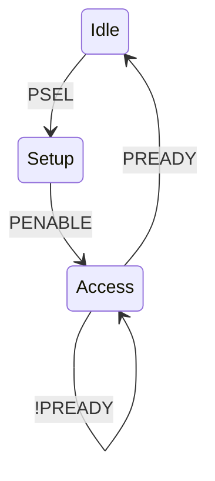

# AMBA APB3 Register Slave and UVM Verification

A synthesizable APB3 register bank with programmable wait states, error responses, a self-checking UVM master environment, SVA, functional coverage, and an executable Verilator smoke test.

## Protocol flow



Four valid registers occupy `0x00–0x0C`. Invalid or unaligned addresses return `PSLVERR`. Full details are in [the specification](docs/specification.md).

## Run

```bash
make uvm
make regress
make lint
make smoke
```

The smoke test performs four writes, four readbacks, one out-of-range access, one unaligned access, and live SVA with two inserted wait states. Passing output is `APB3_SMOKE_PASS checks=10`. The Xcelium regression adds constrained-random traffic and functional coverage.

See [verified results and tool scope](docs/verification_results.md) for the reproducible validation record.

## Interview-level insight

APB is low power because it uses a small, non-pipelined interface and toggles only the selected peripheral during a transfer—not because the data width is necessarily small. Every transfer has a setup phase and at least one access phase; `PREADY` may extend the access phase while address/control remain stable.

## License

MIT — see [LICENSE](LICENSE).
